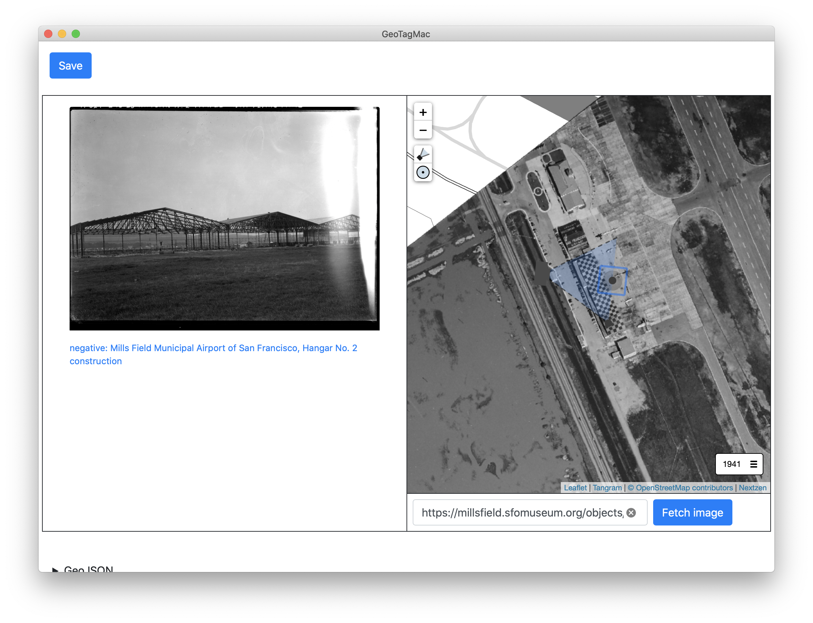

# cocoa-www-geotag-sfomuseum



Experimental work to wrap the [sfomuseum/go-www-geotag-sfomuseum](https://github.com/sfomuseum/go-www-geotag-sfomuseum) application in standalone MacOS binary.

## Important

This is work in progress, including the documentation. In the meantime please have a look at the [Geotagging at SFO Museum](https://millsfield.sfomuseum.org/blog/tags/geotagging) series of blog posts and the [Geotagging at SFO Museum, part 10 – Native Applications](https://millsfield.sfomuseum.org/blog/2020/05/18/geotagging-native/) post in particular.

## Really important

This package does not include a bundled copy of the [go-www-geotag-sfomuseum](https://github.com/sfomuseum/go-www-geotag-sfomuseum) `server` binary, yet. Until it does you will need to build and install it manually:

```
git clone https://github.com/sfomuseum/go-www-geotag-sfomuseum
git clone https://github.com/sfomuseum/cocoa-www-geotag-sfomuseum
cd go-www-geotag-sfomuseum
go build -mod vendor -o ../cocoa-www-geotag-sfomuseum/server.bundle/server cmd/server/main.go
```

## See also:

* https://github.com/sfomuseum/go-www-geotag-sfomuseum
* https://github.com/sfomuseum/go-www-geotag-whosonfirst
* https://github.com/sfomuseum/go-www-geotag
